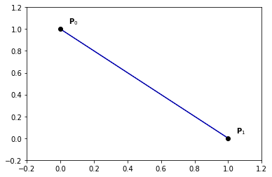
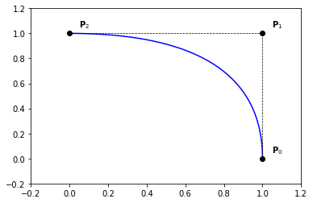
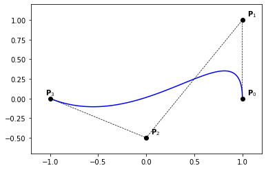

# Bézier curves


We recall the definition of a Bézier curve:

$$
\begin{align}
  \mathcal{C}(t) = \sum_{k=0}^n \mathbf{P}_k B_k^n(t)
\end{align}
$$

where $\left( \mathbf{P} \right)_{0 \le k \le n}$ are the control points or Bézier points.

## Evaluation of a point on Bézier curve

The following function evaluates a Bézier curve, given the control points $P$ at $x$. The degree of the Bernstein polynomials is computed from the length of $P$.


```python
def point_on_bezier_curve(P,x):
    n = len(P) - 1
    b = all_bernstein(n, x)
    c = 0.
    for k in range(0, n+1):
        c += b[k]*P[k]
    return c
```

## Examples

````{prf:example}
:label: bezier-curve-ex-1

```python
nt = 200
ts = np.linspace(0., 1., nt)

P = np.zeros((2, 2))
P[:, 0] = [0., 1.]
P[:, 1] = [1., 0.]

Q = np.zeros((nt, 2))
for i,t in enumerate(ts):
    Q[i,:] = point_on_bezier_curve(P,t)

plt.plot(Q[:,0], Q[:,1], '-b')
plt.plot(P[:,0], P[:,1], '--ok', linewidth=0.7)

for i in range(0, 2):
    x,y = P[i,:]
    plt.text(x+0.05,y+0.05,'$\mathbf{P}_{' + str(i) + '}$')

plt.axis([-0.2, 1.2, -0.2, 1.2])
```
    

````    

````{prf:example}
:label: bezier-curve-ex-2

```python
nt = 200
ts = np.linspace(0., 1., nt)

P = np.zeros((3, 2))
P[:, 0] = [1., 1., 0.]
P[:, 1] = [0., 1., 1.]

Q = np.zeros((nt, 2))
for i,t in enumerate(ts):
    Q[i,:] = point_on_bezier_curve(P,t)

plt.plot(Q[:,0], Q[:,1], '-b')
plt.plot(P[:,0], P[:,1], '--ok', linewidth=0.7)

for i in range(0, 3):
    x,y = P[i,:]
    plt.text(x+0.05,y+0.05,'$\mathbf{P}_{' + str(i) + '}$')

plt.axis([-0.2, 1.2, -0.2, 1.2])
```
    

````    
    
````{prf:example}
:label: bezier-curve-ex-3

```python
nt = 200
ts = np.linspace(0., 1., nt)

P = np.zeros((4, 2))
P[:, 0] = [1., 1., 0., -1.]
P[:, 1] = [0., 1., 1.,  0.]

Q = np.zeros((nt, 2))
for i,t in enumerate(ts):
    Q[i,:] = point_on_bezier_curve(P,t)

plt.plot(Q[:,0], Q[:,1], '-b')
plt.plot(P[:,0], P[:,1], '--ok', linewidth=0.7)

for i in range(0, 3):
    x,y = P[i,:]
    plt.text(x+0.05,y+0.05,'$\mathbf{P}_{' + str(i) + '}$')
i = 3
x,y = P[i,:]
plt.text(x-0.05,y+0.05,'$\mathbf{P}_{' + str(i) + '}$')

plt.axis([-1.2, 1.2, -0.2, 1.2])
```
 

````    
    
````{prf:example}
:label: bezier-curve-ex-4

```python
nt = 200
ts = np.linspace(0., 1., nt)

P = np.zeros((4, 2))
P[:, 0] = [1., 1.,  0., -1.]
P[:, 1] = [0., 1., -0.5,  0.]

Q = np.zeros((nt, 2))
for i,t in enumerate(ts):
    Q[i,:] = point_on_bezier_curve(P,t)

plt.plot(Q[:,0], Q[:,1], '-b')
plt.plot(P[:,0], P[:,1], '--ok', linewidth=0.7)

for i in range(0, 3):
    x,y = P[i,:]
    plt.text(x+0.05,y+0.05,'$\mathbf{P}_{' + str(i) + '}$')
i = 3
x,y = P[i,:]
plt.text(x-0.05,y+0.05,'$\mathbf{P}_{' + str(i) + '}$')

plt.axis([-1.2, 1.2, -0.7, 1.2])
```
    

````    
    
````{prf:example}
:label: bezier-curve-ex-5

```python
nt = 200
ts = np.linspace(0., 1., nt)

P = np.zeros((4, 2))
P[:, 0] = [1., 0., 1., -1.]
P[:, 1] = [0., 1., 1.,  0.]

Q = np.zeros((nt, 2))
for i,t in enumerate(ts):
    Q[i,:] = point_on_bezier_curve(P,t)

plt.plot(Q[:,0], Q[:,1], '-b')
plt.plot(P[:,0], P[:,1], '--ok', linewidth=0.7)

for i in range(0, 3):
    x,y = P[i,:]
    plt.text(x+0.05,y+0.05,'$\mathbf{P}_{' + str(i) + '}$')
i = 3
x,y = P[i,:]
plt.text(x-0.05,y+0.05,'$\mathbf{P}_{' + str(i) + '}$')

plt.axis([-1.2, 1.2, -0.2, 1.2])
```
    

````    

## Derivatives of a Bezier curve

Using the formulae \ref{eq:bernstein-der}, we have

$$
\begin{align}
  \mathcal{C}^\prime(t) = \sum_{k=0}^n \mathbf{P}_k {B_k^n}^\prime(t) 
                        = \sum_{k=0}^n n \mathbf{P}_k \left(B_{k-1}^{n-1}(x) - B_k^{n-1}(x) \right)  
\end{align}
$$

by reordering the indices, we get \ref{eq:bezier-curve-der}

$$
\begin{align}
  \mathcal{C}^\prime(t) &= \sum_{k=0}^{n-1} n \left( \mathbf{P}_{k+1} - \mathbf{P}_k \right) B_k^{n-1}(t) 
  \label{eq:bezier-curve-der}
\end{align}
$$

Therefor, we get the direct acces to the first order derivatives at the extremeties of a Bézier curve using the formulae \ref{eq:bezier-curve-der-1-ext}

$$
\begin{align}
  \begin{cases}
    \mathcal{C}^\prime(0) = n \left( \mathbf{P}_{1} - \mathbf{P}_0 \right)  
    \\ 
    \mathcal{C}^\prime(1) = n \left( \mathbf{P}_{n} - \mathbf{P}_{n-1} \right)  
  \end{cases}
  \label{eq:bezier-curve-der-1-ext}
\end{align}
$$

Second derivatives can also be computed directly from the control points using the formulae  \ref{eq:bezier-curve-der-2-ext}

$$
\begin{align}
  \begin{cases}
    \mathcal{C}^{\prime\prime}(0) = n(n-1) \left( \mathbf{P}_{0} - 2 \mathbf{P}_1 + \mathbf{P}_{2} \right)  
    \\ 
    \mathcal{C}^{\prime\prime}(1) = n(n-1) \left( \mathbf{P}_{n} - 2 \mathbf{P}_{n-1} + \mathbf{P}_{n-2} \right)  
  \end{cases}
  \label{eq:bezier-curve-der-2-ext}
\end{align}
$$


````{prf:definition} $r^{th}$ forward difference

  Let us consider a set of (control) points $\mathbf{P}$.
  The $r^{th}$ forward difference of $\mathbf{P}$ is defined as  
$$
  \begin{align}
    \triangle^r \mathbf{P}_i := \triangle^{r-1} \mathbf{P}_{i+1} - \triangle^{r-1} \mathbf{P}_i  
  \end{align}
$$
  with 
$$
  \begin{align}
    \triangle \mathbf{P}_i = \triangle^1 \mathbf{P}_i := \mathbf{P}_{i+1} - \mathbf{P}_i  
  \end{align}
$$
````

````{prf:proposition} High order dirivatives
$$
  \begin{align}
    \mathcal{C}^{(r)}(t) = \frac{n!}{\left( n-r \right)!} \sum\limits_{i=0}^{n-r} \triangle^r \mathbf{P}_i B_i^{n-r}(t) 
    \label{eq:bezier-high-deriv}
  \end{align}
$$
````

Eqs (\ref{eq:bezier-curve-der-1-ext}) and (\ref{eq:bezier-curve-der-2-ext}) can be generelaized for high order derivatives. We have in fact the following result:

```{prf:remark}
The derivatives of a Bézier curve at its extremeties up to order $r$ depend only on the first (or last) $r+1$ control points, and vice versa.
```

````{prf:proposition}
  \label{prop:bezier-forward-difference}
  $$\triangle^r \mathbf{P}_0 = \sum\limits_{i=0}^{r} \left( -1 \right)^{r-i} \binom{r}{i} \mathbf{P}_i $$
````

## Integration of Bezier curves

````{prf:proposition}
A primitive of A Bézier curve $\mathcal{C}(t) = \sum_{k=0}^n \mathbf{P}_k B_k^n(t)$ has the Bézier representation

$$
\begin{align}
  \left( \int \mathcal{C} \right) (t) = \sum_{k=0}^{n+1} \mathbf{Q}_k B_k^{n+1}(t)
  \label{eq:bezier-primitive}
\end{align}
$$

where

$$
\begin{align}
  \mathbf{Q}_k := \mathbf{Q}_{k-1} + \frac{1}{n+1} \mathbf{P}_{k-1} 
                = \mathbf{Q}_{0}  + \frac{1}{n+1} \left( \sum\limits_{i=0}^{k-1} \mathbf{P}_{i}  \right)
\end{align}
$$
````

Here, $\mathbf{Q}_{0}$ denotes an arbitrary integration constant.

```{prf:remark}
  Using Eq. (\ref{eq:bezier-primitive}), we have $\int_0^1 \mathcal{C}(t)~dt = \frac{1}{n+1}\left( \sum\limits_{i=0}^n \mathbf{P}_i \right)$.
```

## Properties of Bezier curves
Because of the *symmetry* of the Bernstein polynomials, we have

- $\sum_{k=0}^n \mathbf{P}_k B_k^n = \sum_{k=0}^n \mathbf{P}_k B_{n-k}^n$

Thanks to the interpolation property, for $B_0^n$ and $B_n^n$, of the Bernstein polynomials at the endpoints, we get

- $\mathcal{C}(0) = \mathbf{P}_0$  and $\mathcal{C}(1) = \mathbf{P}_n$ 

Using the partition unity property of the Bernstein polynomials, we get

- any point $\mathcal{C}(t)$ is an *affine combination* of the control points 

Therefor,

- Bézier curves are affinely invariant; *i.e.* the image curve $\Phi(\sum_{k=0}^n \mathbf{P}_k B_k^n)$ of a Bézier curve, by an affine mapping $\Phi$, is the Bézier curve having $\left( \Phi(\mathbf{P}_i) \right)_{0 \le i \le n}$ as control points. 

due to the partition unity of the Bernstein polynomials and their non-negativity, 

- any point $\mathcal{C}(t)$ is a *convex combination* of the control points 

finally, we get the *convex hull property*,

- A Bézier curve lies in the convex hull of its control points 

## DeCasteljau Algorithm
In this section, we introduce the deCasteljau algorithm Algo. (\ref{algo:decasteljau}). The basic idea comes from the following remark;
using the reccurence formulae Eq. (\ref{eq:bernstein-rec}), we have

$$
\begin{align}
  \mathcal{C}(t) &= \sum_{k=0}^n \mathbf{P}_k B_k^n(t) = \sum_{k=0}^n \mathbf{P}_k \left( (1-t) B_k^{n-1}(t) + t B_{k-1}^{n-1}(t) \right) \\ 
                 &= \sum_{k=0}^{n-1} \mathbf{P}_k^1  B_k^{n-1}(t) \quad\quad\quad\quad\quad [\mathbf{P}_k^{1} := (1-t)\mathbf{P}_k + t \mathbf{P}_{k+1}] \\ 
                 &= \sum_{k=0}^{n-2} \mathbf{P}_k^2  B_k^{n-2}(t) \quad\quad\quad\quad\quad [\mathbf{P}_k^{2} := (1-t)\mathbf{P}_k^1 + t \mathbf{P}_{k+1}^1] \\ 
                 &= \ldots \\
                 &= \sum_{k=0}^{0} \mathbf{P}_k^n  B_k^{0}(t) \quad\quad\quad\quad\quad [\mathbf{P}_k^{n} := (1-t)\mathbf{P}_k^{n-1} + t \mathbf{P}_{k+1}^{n-1}] \\ 
                 &= \mathbf{P}_0^n 
\end{align}
$$

```{prf:algorithm} Evaluation of a Bézier curve, defined by its control points $\mathbf{P}$ at $x$
:label: algo-decasteljau
**Input** $\mathbf{P}, x$
**Output** $value$

$n \gets { len } \left( \mathbf{P} \right) - 1$

$\mathbf{Q} \gets \mathbf{P}$

For $j \gets 0$ : $n$ 

  For $i \gets 0$ : $n-j$

    $Q[i] \gets (1-x) Q[i] + x Q[i+1]$

Return $Q[0]$
```

```python
def decasteljau(P, x):
    n = len(P) - 1
    Q = P.copy()
    x1 = 1.-x
    for j in range(1, n+1):
        for i in range(0, n-j+1):
            Q[i] = x1*Q[i] + x*Q[i+1]
    c = Q[0]
    return c
```

## Conversion from monomial form
Let us consider a monomial representation of a curve 

$$
\begin{align}
\mathcal{C}(t) = \sum_{k=0}^n \mathbf{Q}_k t^k 
\end{align}
$$

Since

$$
\begin{align}
  t^k &= \frac{1}{\binom{n}{k}} \binom{n}{k} t^k \left(1-t+t \right)^{n-k} 
      = \frac{1}{\binom{n}{k}} \left( \sum\limits_{i=0}^{n-k} \binom{n}{k} \binom{n-k}{n-k-i} t^{i+k} \left( 1-t \right)^{n-k-i} \right) \\
      &= \frac{1}{\binom{n}{k}} \left(  \sum\limits_{i=0}^{n-k} \binom{k+i}{k} B_{k+i}^n(t) \right)
      = \frac{1}{\binom{n}{k}} \left(  \sum\limits_{j=0}^{n} \binom{j}{k} B_{j}^n(t) \right) 
\end{align}
$$

we get,

$$
\begin{align}
\mathcal{C}(t) = \sum_{k=0}^n \mathbf{Q}_k t^k = \sum_{k=0}^n \mathbf{Q}_k \frac{1}{\binom{n}{k}} \left(  \sum\limits_{j=0}^{n} \binom{j}{k} B_{j}^n(t) \right)  
\end{align}
$$

hence,

$$
\begin{align}
\mathcal{C}(t) = \sum_{j=0}^n \left(\sum\limits_{k=0}^{n} \frac{\binom{j}{k}}{\binom{n}{k}} \mathbf{Q}_k \right) B_{j}^n(t)  
\end{align}
$$

which is a Bézier curve of the form

$$
\begin{align}
\mathcal{C}(t) = \sum_{k=0}^n \mathbf{P}_k B_k^n(t)
\end{align}
$$

with 

$$
\begin{align}
\mathbf{P}_k =  \sum\limits_{k=0}^{n} \frac{\binom{j}{k}}{\binom{n}{k}} \mathbf{Q}_k 
\end{align}
$$

```{prf:remark}
  If $\mathbf{Q}_k = 0$ for all $k \geq 2$, then the control points are given by $\mathbf{P}_k = \mathbf{Q}_0 + k \mathbf{Q}_1$.
```

````{prf:proposition} Linear Precision
  Conversly, if the $n+1$ control points $\mathbf{P}$ lie equidistantly on a line, then $\mathcal{C}$ is a linear polynomial, which can be written as $\mathcal{C}(t) = \left(1-t\right) \mathbf{P}_0 + t \mathbf{P}_n$. 
````

## Conversion to monomial form
Given a Bézier curve $\mathcal{C}(t) = \sum_{k=0}^n \mathbf{P}_k B_k^n(t)$, we can derive its monomial representation using the Taylor expansion,

$$
\begin{align}
  \mathcal{C}(t) &= \sum\limits_{k=0}^n \frac{1}{k!}\mathcal{C}^{(k)}(0) t^k \\
                 &= \sum\limits_{k=0}^n \binom{n}{k} \triangle^k \mathbf{P}_0 t^k  
\end{align}
$$

## Rational Bézier curves
We first introduce the notion of Rational Bernstein polynomials defined as,  and $w_i > 0, \forall i \in \left[0, n \right]$ 

$$
\begin{align}
  R_k^n(t) := \frac{w_i B_k^n(t)}{\sum_{i=0}^n w_i B_i^n(t)}
  \label{eq:rational-bernstein}
\end{align}
$$

````{prf:proposition} Properties of Rational Bernstein polynomials
- $R_k^n(x) \ge 0$, for all $k \in \left[0, n \right]$ and $x \in \left[ 0, 1 \right]$ \hfill [positivity] 
- $\sum_{k=0}^n R_k^n(x) = 1$, for all $x \in \left[ 0, 1 \right]$ \hfill [partition of unity] 
- $R_0^n(0) = R_n^n(1) = 1$ 
- $R_k^n$ has exactly one maximum on the interval $\left[ 0, 1 \right]$, 
- Bernstein polynomials are Rational Bernstein polynomials when all weights are equal
````

````{prf:definition} Rational Bézier curve

$$
\begin{align}
  \mathcal{C}(t) = \sum_{k=0}^n \mathbf{P}_k R_k^n(t) 
  \label{eq:bezier-curve}
\end{align}
$$

where $R_k^n(t) := \frac{w_i B_k^n(t)}{\sum_{i=0}^n w_i B_i^n(t)}$ and $w_i > 0, \forall i \in \left[0, n \right]$ 
````  

### Example

````{prf:example}
:label: bezier-curve-ex-7

```python
nt = 200
ts = np.linspace(0., 1., nt)

P = np.zeros((3, 2))
P[:, 0] = [1., 1., 0.]
P[:, 1] = [0., 1., 1.]

# weights
W = np.asarray([1., 1., 2.])

# weithed control points in 3D
Pw = np.zeros((3,3))
for i in range(0, 3):
    Pw[i,:2] = W[i]*P[i,:]
    Pw[i,2]  = W[i]

Qw = np.zeros((nt, 3))
for i,t in enumerate(ts):
    Qw[i,:] = point_on_bezier_curve(Pw,t)

Q = np.zeros((nt, 2))
Q[:,0] = Qw[:,0]/Qw[:,2]
Q[:,1] = Qw[:,1]/Qw[:,2]

plt.plot(Q[:,0], Q[:,1], '-b')
plt.plot(P[:,0], P[:,1], '--ok', linewidth=0.7)

for i in range(0, 3):
    x,y = P[i,:]
    plt.text(x+0.05,y+0.05,'$\mathbf{P}_{' + str(i) + '}$')

plt.axis([-0.2, 1.2, -0.2, 1.2])
```
    

````    
    
## Composite Bézier curve

````{prf:example}
:label: bezier-curve-ex-6

```python
n = 2

nt = 200
ts = np.linspace(0., 1., nt)

# ...
P = np.zeros((3, 2))
P[:, 0] = [1., 1., 0.]
P[:, 1] = [0., 1., 1.]

Q = np.zeros((nt, 2))
for i,t in enumerate(ts):
    Q[i,:] = point_on_bezier_curve(P,t)

plt.plot(Q[:,0], Q[:,1], '-r')
plt.plot(P[:,0], P[:,1], '--or', linewidth=0.7)
# ...

# ...
P = np.zeros((3, 2))
P[:, 0] = [0., -1., 0.]
P[:, 1] = [1., -1., -1.]

Q = np.zeros((nt, 2))
for i,t in enumerate(ts):
    Q[i,:] = point_on_bezier_curve(P,t)

plt.plot(Q[:,0], Q[:,1], '-b')
plt.plot(P[:,0], P[:,1], '--ob', linewidth=0.7)
# ...

# ...
P = np.zeros((3, 2))
P[:, 0] = [1., 1., 0.]
P[:, 1] = [0., -1., -1.]

Q = np.zeros((nt, 2))
for i,t in enumerate(ts):
    Q[i,:] = point_on_bezier_curve(P,t)

plt.plot(Q[:,0], Q[:,1], '-g')
plt.plot(P[:,0], P[:,1], '--og', linewidth=0.7)
# ...
```
    

````    
