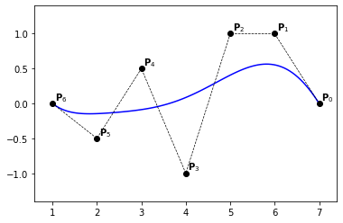
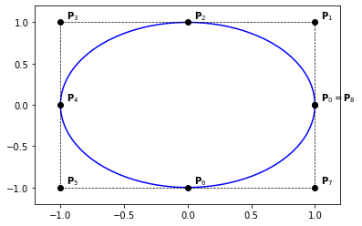

# B-Splines curves

Let $(\mathbf{P}_i)_{ 0 \leqslant i \leqslant n}\in \mathbb{R}^d$  be a sequence of control points. Following the same approach as for Bézier curves, we define B-Splines curves as

````{prf:definition} B-Spline curve
The B-spline curve in $\mathbb{R}^d$ associated to $T=(t_i)_{0\leqslant i \leqslant n + p + 1}$ and $(\mathbf{P}_i)_{ 0 \leqslant i \leqslant n}$ is defined by :

$$
\mathcal{C}(t) = \sum_{i=0}^n N_i^p(t) \textbf{P}_i
$$

````

```{prf:remark}
  The use of open knot vector leads to an **interpolating curve** at the endpoints.
```

## Properties of B-Splines curves

We have the following properties for a B-spline curve:


- If $n=p$, then $\mathcal{C}$ is a Bézier-curve,
- $\mathcal{C}$ is a piecewise polynomial curve,
- The curve interpolates its extremas if the associated multiplicity of the first and the last knot are maximum (*i.e.* equal to $p+1$),
- Invariance with respect to affine transformations,
- B-Spline curves are affinely invariant; *i.e.* the image curve $\Phi(\sum_{i=0}^n \mathbf{P}_i N_i^p)$ of a B-Spline curve, by an affine mapping $\Phi$, is the B-Spline curve having $\left( \Phi(\mathbf{P}_i) \right)_{0 \le i \le n}$ as control points and the same knot vector,
- strong convex-hull property:
  if $t_j \leq t \leq t_{j+1}$, then $\mathcal{C}(t)$ is inside the convex-hull associated to the control points $\mathbf{P}_{j-p},\cdots,\mathbf{P}_{j}$,
- local modification : moving $\mathbf{P}_{j}$ affects $\mathcal{C}(t)$, only in the interval $[t_j,t_{j+p+1}]$,
- the control polygon is a linear approximation of the curve. We will see later that the control polygon converges to the curve under knot insertion and degree elevation (with different *speeds*).
- *Variation diminishing*: no plane intersects the curve more than the control polygon.


## Derivative of a B-spline curve
Using the derivative formula for *B-spline*, we can compute the derivative of a B-Spline curve:

$$
\begin{align}
\mathcal{C}^{\prime}(t) &= \sum_{i=0}^{n} \left( {N_{i}^{p}}^{\prime}(t) \mathbf{P}_i \right) 
\\
                        &= \sum_{i=0}^{n} \left( \frac{p}{t_{i+p}-t_{i}}N_{i}^{p-1}(t) \mathbf{P}_i - \frac{p}{t_{i+1+p}-t_{i+1}}N_{i+1}^{p-1}(t) \mathbf{P}_i \right)
\\
                        &= \sum_{i=0}^{n} \frac{p}{t_{i+p}-t_{i}}N_{i}^{p-1}(t) \mathbf{P}_i - \sum_{i=1}^{n+1} \frac{p}{t_{i+p}-t_{i}}N_{i}^{p-1}(t) \mathbf{P}_{i-1}
\\
                        &= \sum\limits_{i} {N_{i}^{p-1}}(t)\frac{p}{t_{i+p}-t_{i}} \left( \mathbf{P}_i - \mathbf{P}_{i-1} \right) 
\\
                        &= \sum\limits_{i} {N_{i}^{p-1}}(t) \frac{p}{t_{i+p}-t_{i}} \nabla \mathbf{P}_i
\end{align}
$$

where we introduced the **first backward difference** operator $\nabla \mathbf{P}_i := \mathbf{P}_i - \mathbf{P}_{i-1}$.

````{prf:example}
:label: bsplines-curves-ex-1

we consider a quadratic B-Spline curve with the knot vector $T=\{000~\frac{2}{5}~\frac{3}{5}~111 \}$. 

We have $\mathcal{C}(t) = \sum_{i=0}^{4} {N_{i}^{2}}^{\prime}(t) \mathbf{P}_i $, then

$$
\mathcal{C}^{\prime}(t) = \sum\limits_{i} {N_{i}^{1}}(t) \mathbf{Q}_i
$$

where 

$$
\mathbf{Q}_0 = 5 \{\mathbf{P}_{2} - \mathbf{P}_1\} ~~~~\mathbf{Q}_1 = \frac{10}{3} \{ \mathbf{P}_{3} - \mathbf{P}_2\}
$$

$$
\mathbf{Q}_2 = \frac{10}{3} \{ \mathbf{P}_{4} - \mathbf{P}_3\}~~~~\mathbf{Q}_3 = 5 \{\mathbf{P}_{5} - \mathbf{P}_4\}
$$

the *B-splines* $\{ N_{i}^{1},~0 \leq i \leq 3\}$ are associated to the knot vector $T^{\ast}=\{00~\frac{2}{5}~\frac{3}{5}~11 \}$.
````

```python
# needed imports
import numpy as np
import matplotlib.pyplot as plt
```

```python
# importing bsplines utilities
from bsplines_utilities import find_span, all_bsplines, point_on_bspline_curve
```

## Examples

````{prf:example}
:label: bsplines-curves-ex-2

```python
knots  = [0., 0., 0., 1., 1., 1.]
degree = 2
n      = len(knots) - degree - 1

P = np.zeros((n, 2))
P[:, 0] = [1., 1., 0.]
P[:, 1] = [0., 1., 1.]    

nx = 101
xs = np.linspace(0., 1., nx)

Q = np.zeros((nx, 2))
for i,x in enumerate(xs):
    Q[i,:] = point_on_bspline_curve(knots, P, x)

plt.plot(Q[:,0], Q[:,1], '-b')
plt.plot(P[:,0], P[:,1], '--ok', linewidth=0.7)

for i in range(0, n):
    x,y = P[i,:]
    plt.text(x+0.05,y+0.05,'$\mathbf{P}_{' + str(i) + '}$')

plt.axis([-0.2, 1.2, -0.2, 1.2])
```
    

````    

````{prf:example}
:label: bsplines-curves-ex-3

```python
knots  = [0., 0., 0., 0., 1., 1., 1., 1.]
degree = 3
n      = len(knots) - degree - 1

P = np.zeros((n, 2))
P[:, 0] = [1., 1., 0., -1.]
P[:, 1] = [0., 1., 1.,  0.]  

nx = 101
xs = np.linspace(0., 1., nx)

Q = np.zeros((nx, 2))
for i,x in enumerate(xs):
    Q[i,:] = point_on_bspline_curve(knots, P, x)

plt.plot(Q[:,0], Q[:,1], '-b')
plt.plot(P[:,0], P[:,1], '--ok', linewidth=0.7)

for i in range(0, n):
    x,y = P[i,:]
    plt.text(x+0.05,y+0.05,'$\mathbf{P}_{' + str(i) + '}$')

plt.axis([-1.2, 1.2, -0.2, 1.2])
```
    

````    

````{prf:example}
:label: bsplines-curves-ex-4

```python
knots  = [0., 0., 0., 0.25, 0.5, 0.75, 1., 1., 1.]
degree = 2
n      = len(knots) - degree - 1

P = np.zeros((n, 2))
P[:, 0] = [0.,  1., 1., -2., -1., -2.]
P[:, 1] = [.5, -1., 1.,  1.,  0., -1.]   

nx = 101
xs = np.linspace(0., 1., nx)

Q = np.zeros((nx, 2))
for i,x in enumerate(xs):
    Q[i,:] = point_on_bspline_curve(knots, P, x)

plt.plot(Q[:,0], Q[:,1], '-b')
plt.plot(P[:,0], P[:,1], '--ok', linewidth=0.7)

for i in range(0, n):
    x,y = P[i,:]
    plt.text(x+0.05,y+0.05,'$\mathbf{P}_{' + str(i) + '}$')

plt.axis([-2.2, 1.3, -1.2, 1.4])
```
    

````    

````{prf:example}
:label: bsplines-curves-ex-5

```python
knots  = [0., 0., 0., 0.25, 0.5, 0.5, 0.75, 1., 1., 1.]
degree = 2
n      = len(knots) - degree - 1

P = np.zeros((n, 2))
P[:, 0] = [0.,  1., 1., 0., -2., -1., -2.]
P[:, 1] = [.5, -1., 1., 2.,  1.,  0., -1.]   

nx = 101
xs = np.linspace(0., 1., nx)

Q = np.zeros((nx, 2))
for i,x in enumerate(xs):
    Q[i,:] = point_on_bspline_curve(knots, P, x)

plt.plot(Q[:,0], Q[:,1], '-b')
plt.plot(P[:,0], P[:,1], '--ok', linewidth=0.7)

for i in range(0, n):
    x,y = P[i,:]
    plt.text(x+0.05,y+0.05,'$\mathbf{P}_{' + str(i) + '}$')

plt.axis([-2.2, 1.3, -1.2, 2.2])
```
    

````    

````{prf:example}
:label: bsplines-curves-ex-6

```python
knots  = [0., 0., 0., 0.25, 0.5, 0.5, 0.75, 1., 1., 1.]
degree = 2
n      = len(knots) - degree - 1

P = np.zeros((n, 2))
P[:, 0] = [0.,  1., 1., 0., -2., -1., -2.]
P[:, 1] = [.5, -1., 1., 1.,  1.,  0., -1.]   

nx = 101
xs = np.linspace(0., 1., nx)

Q = np.zeros((nx, 2))
for i,x in enumerate(xs):
    Q[i,:] = point_on_bspline_curve(knots, P, x)

plt.plot(Q[:,0], Q[:,1], '-b')
plt.plot(P[:,0], P[:,1], '--ok', linewidth=0.7)

for i in range(0, n):
    x,y = P[i,:]
    plt.text(x+0.05,y+0.05,'$\mathbf{P}_{' + str(i) + '}$')

plt.axis([-2.2, 1.3, -1.2, 1.2])
```
    

````    

````{prf:example}
:label: bsplines-curves-ex-7

```python
knots  = [0., 0., 0., 0., 0., 0., 0., 1., 1., 1., 1., 1., 1., 1.]
degree = 6
n      = len(knots) - degree - 1

P = np.zeros((n, 2))
P[:, 0] = [7., 6., 5.,  4., 3., 2., 1.]
P[:, 1] = [0., 1., 1., -1., .5, -.5, 0.]   

nx = 101
xs = np.linspace(0., 1., nx)

Q = np.zeros((nx, 2))
for i,x in enumerate(xs):
    Q[i,:] = point_on_bspline_curve(knots, P, x)

plt.plot(Q[:,0], Q[:,1], '-b')
plt.plot(P[:,0], P[:,1], '--ok', linewidth=0.7)

for i in range(0, n):
    x,y = P[i,:]
    plt.text(x+0.05,y+0.05,'$\mathbf{P}_{' + str(i) + '}$')

plt.axis([0.6, 7.4, -1.4, 1.4])
```
    

````    

````{prf:example}
:label: bsplines-curves-ex-8

```python
    knots  = [0., 0., 0., .2, .4, .6, .8, 1., 1., 1.]
    degree = 2
    n      = len(knots) - degree - 1
    
    P = np.zeros((n, 2))
    P[:, 0] = [7., 6., 5.,  4., 3., 2., 1.]
    P[:, 1] = [0., 1., 1., -1., .5, -.5, 0.]   
    
    nx = 101
    xs = np.linspace(0., 1., nx)
    
    Q = np.zeros((nx, 2))
    for i,x in enumerate(xs):
        Q[i,:] = point_on_bspline_curve(knots, P, x)

    plt.plot(Q[:,0], Q[:,1], '-b')
    plt.plot(P[:,0], P[:,1], '--ok', linewidth=0.7)
    
    for i in range(0, n):
        x,y = P[i,:]
        plt.text(x+0.05,y+0.05,'$\mathbf{P}_{' + str(i) + '}$')

    plt.axis([0.6, 7.4, -1.4, 1.4])
```
    

````    

## Rational B-Splines (NURBS) curves

We recall that NURBS are defined as

$$
  R_i^p(t) := \frac{w_i N_i^p(t)}{\sum_{j=0}^n w_j N_j^p(t)}
$$

where $w_i > 0, \forall i \in \left[0, n \right]$ are non-negative real numbers, called the weights.

NURBS curves are then defined as

$$
  \mathcal{C}(t) = \sum_{i=0}^n \mathbf{P}_i R_i^p(t) 
$$

Notice that a NURBS curve in $\mathbb{R}^d$ can be described as a NURBS curve in $\mathbb{R}^{d+1}$ using the control points:

$\textbf{P}^{\omega}_i = ( \omega_i \textbf{P}_i, \omega_i )$

This remark is used for the evaluation and also to extend most of the B-Splines fundamental geometric operations to NURBS curves.

```{prf:remark}
Although there is a function **point_on_nurbs_curve** to evaluate NURBS curves, we make use of an explicit call to the spline version in this notebook.
```

### Examples

````{prf:example} Quarter circle 
:label: nurbs-curves-ex-1

```python
knots  = [0., 0., 0., 1., 1., 1.]
degree = 2
n      = len(knots) - degree - 1

P = np.zeros((n, 2))
P[:, 0] = [1., 1., 0.]
P[:, 1] = [0., 1., 1.]

# weights
s2 = 1./np.sqrt(2)
W = np.zeros(n)
W[:] = [1., s2, 1.]

# weithed control points in 3D
Pw = np.zeros((n,3))
for i in range(0, n):
    Pw[i,:2] = W[i]*P[i,:]
    Pw[i,2]  = W[i]

nx = 200
xs = np.linspace(0., 1., nx)    

Qw = np.zeros((nx, 3))
for i,x in enumerate(xs):
    Qw[i,:] = point_on_bspline_curve(knots, Pw, x)

Q = np.zeros((nx, 2))
Q[:,0] = Qw[:,0]/Qw[:,2]
Q[:,1] = Qw[:,1]/Qw[:,2]

plt.plot(Q[:,0], Q[:,1], '-b')
plt.plot(P[:,0], P[:,1], '--ok', linewidth=0.7)

for i in range(0, n):
    x,y = P[i,:]
    plt.text(x+0.05,y+0.05,'$\mathbf{P}_{' + str(i) + '}$')

plt.axis([-0.2, 1.2, -0.2, 1.2])    
```
    

````    

````{prf:example} Circular arc of $120°$ 
:label: nurbs-curves-ex-2

```python
knots  = [0., 0., 0., 1., 1., 1.]
degree = 2
n      = len(knots) - degree - 1

P = np.zeros((n, 2))
a = np.cos(np.pi/6.)
P[:, 0] = [ a, 0., -a]
P[:, 1] = [.5, 2., .5]

# weights
W = np.zeros(n)
W[:] = [1., 1./2., 1.]

# weithed control points in 3D
Pw = np.zeros((n,3))
for i in range(0, n):
    Pw[i,:2] = W[i]*P[i,:]
    Pw[i,2]  = W[i]

nx = 200
xs = np.linspace(0., 1., nx)    

Qw = np.zeros((nx, 3))
for i,x in enumerate(xs):
    Qw[i,:] = point_on_bspline_curve(knots, Pw, x)

Q = np.zeros((nx, 2))
Q[:,0] = Qw[:,0]/Qw[:,2]
Q[:,1] = Qw[:,1]/Qw[:,2]

plt.plot(Q[:,0], Q[:,1], '-b')
plt.plot(P[:,0], P[:,1], '--ok', linewidth=0.7)

for i in range(0, n):
    x,y = P[i,:]
    plt.text(x+0.05,y+0.05,'$\mathbf{P}_{' + str(i) + '}$')

plt.axis([-1.2, 1.2, .0, 2.2])    
```
    

````    

````{prf:example} half circle 
:label: nurbs-curves-ex-3

```python
knots  = [0., 0., 0., 0., 1., 1., 1., 1.]
degree = 3
n      = len(knots) - degree - 1

P = np.zeros((n, 2))
P[:, 0] = [1., 1., -1., -1.]
P[:, 1] = [0., 2.,  2.,  0.]

# weights
W = np.zeros(n)
W[:] = [1., 1./3., 1./3., 1.]

# weithed control points in 3D
Pw = np.zeros((n,3))
for i in range(0, n):
    Pw[i,:2] = W[i]*P[i,:]
    Pw[i,2]  = W[i]

nx = 200
xs = np.linspace(0., 1., nx)    

Qw = np.zeros((nx, 3))
for i,x in enumerate(xs):
    Qw[i,:] = point_on_bspline_curve(knots, Pw, x)

Q = np.zeros((nx, 2))
Q[:,0] = Qw[:,0]/Qw[:,2]
Q[:,1] = Qw[:,1]/Qw[:,2]

plt.plot(Q[:,0], Q[:,1], '-b')
plt.plot(P[:,0], P[:,1], '--ok', linewidth=0.7)

for i in range(0, n):
    x,y = P[i,:]
    plt.text(x+0.05,y+0.05,'$\mathbf{P}_{' + str(i) + '}$')

plt.axis([-1.2, 1.2, -.2, 2.2])    
```
    

````    

````{prf:example} Circle as 4 arcs 
:label: nurbs-curves-ex-4

We already saw how to construct a circular arc (with angle = $\frac{\pi}{2}$, using Bézier curves.

Constructing a circular arc can be done in different ways. In this example, we consider a B-Spline curve as a composite of 4 Bézier curves.


```python
knots  = [0., 0., 0., .25, .25, .5, .5, .75, .75, 1., 1., 1.]
degree = 2
n      = len(knots) - degree - 1

P = np.zeros((n, 2))
P[:, 0] = [1., 1., 0., -1., -1., -1.,  0.,  1., 1.]
P[:, 1] = [0., 1., 1.,  1.,  0., -1., -1., -1., 0.]

# weights
s2 = 1./np.sqrt(2)
W = np.zeros(n)
W[:] = [1., s2, 1., s2, 1., s2, 1., s2, 1.]

# weithed control points in 3D
Pw = np.zeros((n,3))
for i in range(0, n):
    Pw[i,:2] = W[i]*P[i,:]
    Pw[i,2]  = W[i]

nx = 200
xs = np.linspace(0., 1., nx)    

Qw = np.zeros((nx, 3))
for i,x in enumerate(xs):
    Qw[i,:] = point_on_bspline_curve(knots, Pw, x)

Q = np.zeros((nx, 2))
Q[:,0] = Qw[:,0]/Qw[:,2]
Q[:,1] = Qw[:,1]/Qw[:,2]

plt.plot(Q[:,0], Q[:,1], '-b')
plt.plot(P[:,0], P[:,1], '--ok', linewidth=0.7)

for i in range(1, n-1):
    x,y = P[i,:]
    plt.text(x+0.05,y+0.05,'$\mathbf{P}_{' + str(i) + '}$')
    
# plot P_0 = P_8
x,y = P[0,:]
plt.text(x+0.05,y+0.05,'$\mathbf{P}_0 = \mathbf{P}_8$')

plt.axis([-1.2, 1.2, -1.2, 1.2])    
```
    

````    

````{prf:example} Circle as 3 arcs 
:label: nurbs-curves-ex-5

We already saw how to construct a circular arc (with angle = $120°$, using Bézier curves.

In this example, we consider a B-Spline curve as a composite of 3 Bézier curves.


```python
knots  = [0., 0., 0., 1./3., 1./3., 2./3., 2./3., 1., 1., 1.]
degree = 2
n      = len(knots) - degree - 1

P = np.zeros((n, 2))
a = np.cos(np.pi/6.)
P[:, 0] = [ a, 0., -a, -2*a,  0., 2*a,  a]
P[:, 1] = [.5, 2., .5,  -1., -1., -1., .5]

# weights
W = np.zeros(n)
W[:] = [1., 1./2., 1., 1./2., 1., 1./2., 1.]

# weithed control points in 3D
Pw = np.zeros((n,3))
for i in range(0, n):
    Pw[i,:2] = W[i]*P[i,:]
    Pw[i,2]  = W[i]

nx = 200
xs = np.linspace(0., 1., nx)    

Qw = np.zeros((nx, 3))
for i,x in enumerate(xs):
    Qw[i,:] = point_on_bspline_curve(knots, Pw, x)

Q = np.zeros((nx, 2))
Q[:,0] = Qw[:,0]/Qw[:,2]
Q[:,1] = Qw[:,1]/Qw[:,2]

plt.plot(Q[:,0], Q[:,1], '-b')
plt.plot(P[:,0], P[:,1], '--ok', linewidth=0.7)

for i in range(1, n-1):
    x,y = P[i,:]
    plt.text(x+0.05,y+0.05,'$\mathbf{P}_{' + str(i) + '}$')
    
# plot P_0 = P_6
x,y = P[0,:]
plt.text(x+0.05,y+0.05,'$\mathbf{P}_0 = \mathbf{P}_8$')

plt.axis([-2.2, 2.2, -1.2, 2.2])    
```
    

````
