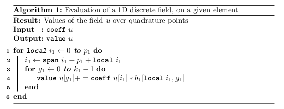
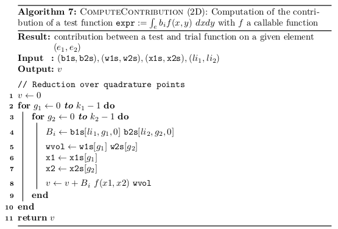

# Introduction to B-Splines FEM

Let $\Omega \subset \mathbb{R}^d$ be a computational domain that is the image of a logical domain $\mathcal{P}$, *i.e.* a unit line (in *1d*), square (in *2d*) or a cube (in *3d*) with a **mapping** function 

$$
\Omega = \mathcal{G} (\mathcal{P}) 
$$

We consider the Poisson problem with Homogeneous Dirichlet boundary conditions:

$$
  \mbox{Find} ~  u \in H^1_0(\Omega), ~ \mbox{such that}
$$
$$
  - \nabla^2 u = f, ~~ \Omega
$$

Using a Galerkin-Rietz method, we introduce a discrete finite elements space $\mathcal{V}_h = \mathbf{span}\{ \phi_j, 1 \leq j \leq n_V \}$ for trial and test functions. Here the index $j$ is a multi-index. For example, in $2D$, we have $j = (j_1, j_2)$

Let $u_h \in \mathcal{V}_h$ such that $u_h = \sum_{j=1}^{n_V} u_j \phi_j$. Then the weak formulation for the Poisson equation writes

$$
  \sum_{j=1}^{n} u_j \int_{\Omega} \nabla \phi_j \cdot \nabla \phi_i = \int_{\Omega} f \phi_i, \quad \forall  1 \leq i \leq n 
$$

which can be written in a matrix form

$$
  M U = F
$$

where $U$ denotes the coefficients $(u_j, ~ 1 \leq j \leq n)$ and $F$ is a vector consisting of the terms $\int_{\Omega} f \phi_i$ for $1 \leq i \leq n$. Finally, the matrix $M$ is called the **stiffness** matrix and its entries are defined as

$$
  M_{ij} = \int_{\Omega} \nabla \phi_j \cdot \nabla \phi_i
$$

We will denote our basis function by $b_i$ and $b_j$ rather than $\phi_i$ and $\phi_j$. In this case, in order to solve the Poisson problem, one needs to

1. Assemble the matrix $M$ of entries
$$
  M_{ij} = \int_{\Omega} \nabla b_j \cdot \nabla b_i
$$
2. Assemble the right hand side $F$ of entries
$$
  F_{i} = \int_{\Omega} f b_i
$$
3. Solve the linear system 
$$
  M U = F
$$

Since at the end, we need to compute the $L^2$-norm of the error $u-u_h$, we need also to evaluate (discretize) the following (scalar) expression:

$$
\| e_h \|_{L^2}^2 := \| u-u_h \|_{L^2}^2 = \int_{\Omega} (u-u_h)^2
$$

## Discretization of the Poisson problem

Now let's go back to a matrix entry $M_{ij}$, we have
$$
M_{ij} = \sum_e \int_{Q_e} \nabla b_i \cdot \nabla b_j
$$
We know that every basis function $b_i$ is a polynomial over the element $Q_i$. We can then use one of the Gauss quadrature formulae. 

**Note**:
In the case of *B-splines* we will avoid having to evaluate on the boundary of our element (B-Splines are only defined on the right, if we don't do so, evaluating derivatives may lead to wrong results). Hence we will use the Gauss-Legendre formula.

**Note**:
In general, the quadrature formulae are given on the interval $[-1, 1]$. We therefor need to remap these points for every element, in out partition.

Let's assume now that our quadrature points have been remapped, and let's call them $\xi_k$, $\omega_k$ will denote the associated weight to $\xi_k$.
In this case $M_{ij}$ can be written as

$$
M_{ij} = \sum_e \sum_k \omega_k \nabla b_i(\xi_k) \cdot \nabla b_j( \xi_k)
$$

Now let's go back to a rhs entry $F_{i}$, we have
$$
F_{i} = \sum_e \int_{Q_e} f b_i 
$$
We know that every basis function $b_i$ is a polynomial over the element $Q_i$. We can then use one of the Gauss quadrature formulae. 

Since our quadrature points have been remapped ( points : $\xi_k$, weights : $\omega_k$ ).

In this case $F_{i}$ can be written as

$$
F_{i} = \sum_e \sum_k \omega_k b_i(\xi_k) f( \xi_k)
$$

Now let's go back to a norm $e_h$, we have
$$
\| e_h \|_{L^2}^2 = \sum_e \int_{Q_e} (u-u_h)^2 
$$

which leads to

$$
\| e_h \|_{L^2}^2 = \sum_e \sum_k \omega_k (u(\xi_k) - u_h( \xi_k))^2
$$

The missing part here, is how to evaluate the discrete field $u_h$. This will be covered in the next part.

## Expressions

When using a Finite Elements method, one needs to compute the following kind of expressions:

* **bilinear form**. Example : $\int_{\Omega} \phi_i \phi_j ~ d\Omega$
* **linear form**. Example : $\int_{\Omega} f \phi_i ~ d\Omega$ 
* **functional**, i.e. integral of a scalar (vector) expression. Example : $\int_{\Omega} (u-u_h)^2$  

A general formal definition of a variational form $a$ is given by Eq. \ref{eq:var-form-def}, as real-valued \textit{multi-linear} map on the product of a sequence of function spaces  $\{V_j\}_{j=1}^\rho$ :

\begin{align}
  a = 
  \begin{cases}
  V_\rho \times \ldots \times V_2 \times V_1 \times \mathcal{P} \rightarrow \mathbb{R}
  \\
  a(v_\rho, \dots, v_1; w_1, \dots, w_\nu, c_1, \dots, c_\eta)
  \end{cases}
  \label{eq:var-form-def}
\end{align}

where $\rho$ is the arity of the variational form, and the special cases $\rho=0,1,2$ yield to the notions of \emph{functional}, \emph{linear form} and \emph{bilinear form}, respectively.
Each of the spaces $V_j$ may be a scalar/vector function space, or a product of other function spaces.
$\mathcal{P}$ is the space of all parameters (which can be empty), containing either functions or constants (with respect to differential operators).
A function parameter is referred to as a \emph{field} and is an element of a function space, therefore it may be represented by its coefficients over a given basis.
The general definition of the space of parameters is given as $\mathcal{P} := \left( W_1 \times \ldots \times W_\nu \right) \times \mathbb{R}^\eta$ where $\left( W_i \right)_{1 \le i \le \nu}$ can be scalar or vector function spaces and $\eta$ is the number of (real) constants.
We shall refer to the parameters as \textit{free variables}, as they will not appear in the signature of the variational form, and are defined as global variables (or local to the current scope).

In the sequel, we shall see how the different expressions can be evaluated. We will developp the different needed algorithms, that we will use in the next chapters.

Since, we will end up by computing an integral over the domain, we will need the following procedures

* Assembly over the domain: this will loop over the elements of the domain. In each element, we shall call a kernel procedure that performs the computation over one single element. 
* depending on the multi-linear map (expression) to evaluate, we shall have three kinds of kernels:
  - a kernel for computing expressions with arity of 2
  - a kernel for computing expressions with arity of 1 
  - a kernel for computing expressions with arity of 0
* we shall not discuss for the moment the data structure used to store the results of the kernels

## Notations

In the sequel, we shall use the following arguments

* n_elements_d (d=1,2,3) number of elements of the grid in each direction
* an element will always refer to a grid element, which considered as the a tuple
* k_d (d=1,2,3) will denote the number of quadrature points in each direction, with respect to current element
* The operator $\texttt{coeff}$ will denote the local coefficients of a field over the current element 
* The operator $\texttt{value}$ will denote the values of a field over the current element 

## Assembly procedures

The generic form of the assembly procedure is described next. In general, it is splitted in 3 parts:

* Pre-process: select the needed data, related to the current element. 
* Process: call the kernel for computations on the given element
* Post-process: 

### Pre-process

For each function space (both $V_i$ and $W_i$) involved in the expression, we need to get the basis functions over the current element, as well as their spans.  

The following examples are not general, since we consider only one function space.

## Evaluation of a discrete field on a given element

When a free-variable is used in the expression, one needs to evaluate it on the quadrature points. In what follows, we describe the evaluation of a discrete field, with respect to a given element

## Kernel for an expression with arity = 1

### Computing contributions of test basis functions (1D)

### Computing contributions of test basis functions (2D)

## Kernel for an expression with arity = 2

### Computing contributions between test and trial basis functions (1D)

### Computing contributions between test and trial basis functions (2D)

