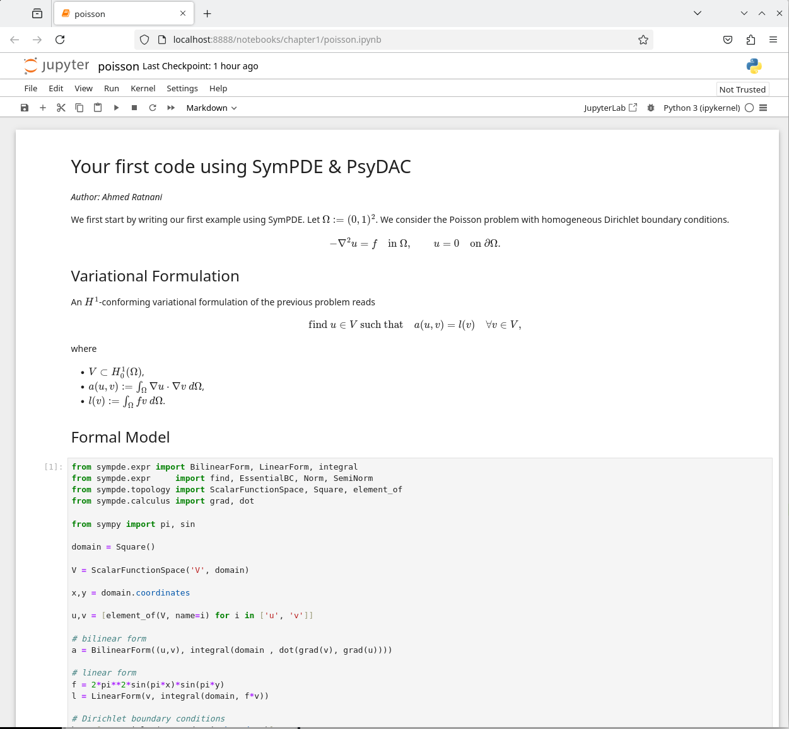

# Installation

To be able to run the examples in this guide, we recommend to follow these steps:

1. Download the [IGA-Python] source files.

```bash
git clone https://github.com/pyccel/IGA-Python.git

# Save and show the absolute path to the IGA-Python directory.
IGA_PYTHON_DIR=$(realpath IGA-Python)
echo "IGA_PYTHON_DIR=${IGA_PYTHON_DIR}"
```

2. Create a virtual Python environment.

```shell
python3 -m venv iga-python-env

# Save and show the absolute path to the IGA-Python environment script.
IGA_PYTHON_ENV=$(realpath iga-python-env/bin/activate)
echo "IGA_PYTHON_ENV=${IGA_PYTHON_ENV}"
```

2. Install the necessary Python packages.

```shell
cd ${IGA_PYTHON_DIR}

# Python packages required by IGA-Python will 
# be installed in IGA-Python virtual environment.
source ${IGA_PYTHON_ENV}
pip3 install -r requirements.txt
```

3. Launch Jupyter notebook.

```shell
jupyter notebook
```

The above command should automatically launch your web browser and show you the [IGA-Python] files you've downloaded from Step 1:


Try opening a sample notebook. Navigate to `chapter1/` and find `poisson.ipynb`:


Open `poisson.ipynb`. Check that you can successfully run all cells in this notebook. 




[IGA-Python]: https://github.com/pyccel/IGA-Python.git